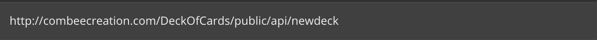
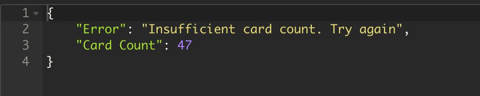
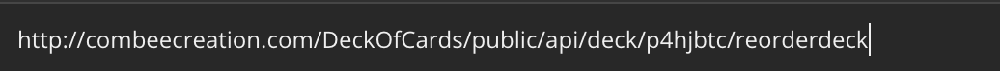
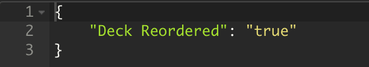

# Card-Dealing-API
This is a Rest API that was developed in PHP with the Laravel framework. I uploaded the zip folder to the whole project as it has to many folders to uploaded individually. I also uploaded the routes folder so that you can see the raw code for this API which can be found in the web.php file.

# How to use API
To get started with the api you will need to visit:http://combeecreation.com/DeckOfCards/public/api/newdeck. The default order of the deck is spades,hearts, clubs, and dimonds from 2-A.

You JSON response will look like this returning you unique deckId number.

## Deal Card
Once you have your deck ID you can begin to use the API.
To deal a card you enter the url http://combeecreation.com/DeckOfCards/public/api/deck/{deck_id}/deal/{num} and specifie how many cards you want to be dealt in the {num} field.

Once done you will recieve a response with the card count, card, and link to card image:

## Shuffle Deck
To shuffle the deck follow this url http://combeecreation.com/DeckOfCards/public/api/deck/{deck_id}/shuffle.

JSON response

## Discard
To discard a card from the cards that have been dealt follow this url  
http://combeecreation.com/DeckOfCards/public/api/deck/{deck_id}/discard/{dis_card}

JSON response

## Cut Deck
To cut the deck follow this url http://combeecreation.com/DeckOfCards/public/api/deck/{deck_id}/cut/{num}

JSON response

If a number is entered in that exceeds the amount of cards that are in the deck you will get a error response

## Reoder Deck
When you reorder the deck it simple puts the deck back into it's origianl format with what cards are left in the deck.

Json response

