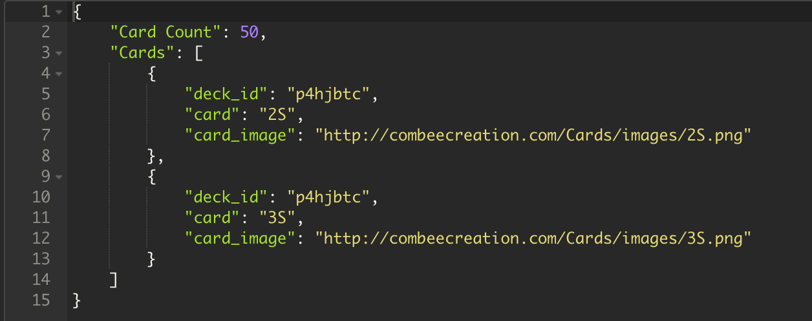

# Card-Dealing-API
This is a Rest API that was developed in PHP with the Laravel framework. I uploaded the zip folder to the whole project as it has to many folders to uploaded individually. I also uploaded the routes folder so that you can see the raw code for this API which can be found in the web.php file.

# How to use API
To get started with the api you will need to visit:

You JSON response will look like this returning you unique deckId number.

Once you have your deck ID you can begin to use the API.
To deal a card you enter the url http://combeecreation.com/DeckOfCards/public/api/deck/{deck_id}/deal/{num} and specifie how many cards you want to be dealt in the {num} field.

Once done you will recieve a response with the card count, card, and link to card image:

